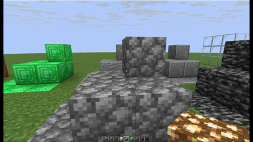
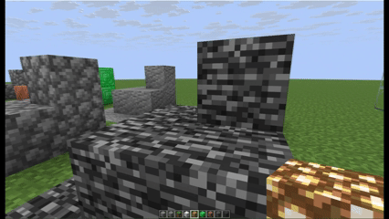
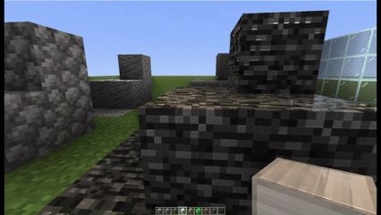
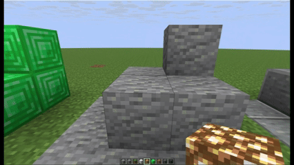
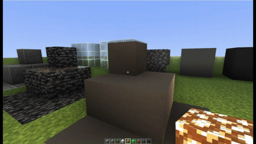

# Material Lab

### A Physically-Based Rendering Shader Pack for Minecraft

**CS 184 · Final Project · UC Berkeley · Spring 2026**

**Team:** Wang · Sasanur · Chan · Valerius
**Stack:** GLSL · Iris · LabPBR 1.3
**Pipeline:** Deferred · 3-stage MRT

Re-engineering Minecraft's flat lighting into a physically-grounded shading system: complete with Cook-Torrance microfacets, screen-space ray marching, and material-aware reflections that respond to roughness, metallicity, and view angle.

---

## Deliverables

- **Final Presentation Video** — [Watch on Google Drive](https://drive.google.com/file/d/1GgM3EClYUV8wMCmgEFBoJoN4uD0JtZfB/view?usp=sharing)
- **Slide Deck** — [View on Google Slides](https://docs.google.com/presentation/d/12vnO9p6jl95lkaixI-3OPnulw1gWHO9K6Q0C3NfcwBQ/edit?usp=sharing)
- **Stylized webpage version** — [final/index.html](./)

### Demo Videos

- **Cook-Torrance BRDF demo** — [Watch on Google Drive](https://drive.google.com/file/d/1jDZAFnavjtQjLZXhzQy6RJD_ggMuWSUT/view?usp=sharing)
- **SSR & SSAO demo** — [Watch on Google Drive](https://drive.google.com/file/d/1wx98Ia-LM1YfZ01ZbgCqVYHr2usElZQn/view?usp=sharing)
- **Water reflection demo** — [Watch on Google Drive](https://drive.google.com/file/d/1sUwsq5sYDh6eFHTD9tT7EGkmDmlRss8j/view?usp=sharing)

---

## 00 / Abstract

### An exercise in making blocks feel real.

We replaced Minecraft's default lighting with a unified physically-based rendering pipeline: Cook-Torrance microfacets driven by per-pixel material properties, screen-space reflections, ambient occlusion, and a procedural sky. Everything runs in real time.

Minecraft's vanilla shading is a single Lambertian dot product against a fixed directional light. Surfaces don't reflect their environment; metals don't tint their highlights; water doesn't really know the sky exists. We rebuilt the lighting pipeline from the ground up around a principled **Cook-Torrance BRDF**, with material parameters streamed in from the LabPBR 1.3 texture standard.

Beyond the forward shading pass, we added a deferred composite stage that ray-marches both **screen-space ambient occlusion** and **screen-space reflections** against the depth buffer: a minimal ray-tracing MVP that delivers grounded contact shadows and material-aware reflections without leaving the GPU's comfort zone. When a reflection ray escapes the screen, a procedural environment probe takes over so metals never look matte.

The result is a living, reactive scene: torchlight that warms surfaces, armor that catches the sun, water that fades from transparent at your feet to mirror-bright at the horizon. Same blocks. Different physics.

> The pack is named *Material Lab* because the dominant aesthetic choice was to make every material behavior data-driven through textures rather than special-cased in code.

> We chose Iris over OptiFine because it's actively maintained, ships modern OpenGL features, and exposes the per-frame uniforms (`heldBlockLightValue`, `shadowLightPosition`) we needed for dynamic lighting.

---

## 01 / Pipeline

### A three-stage deferred renderer.

Per-object forward shading writes a fat G-buffer; a full-screen composite pass adds ray-marched effects; a final blit ships pixels to the framebuffer.

### File Layout

```
shaders/
├── shaders.properties              # pack config: shadow res, blend modes
│
├── gbuffers_skybasic.vsh/.fsh      # procedural sky dome (no texture)
├── gbuffers_skytextured.vsh/.fsh   # sun, moon textures
├── gbuffers_terrain.vsh/.fsh       # opaque world blocks (the "main" shader) ★
├── gbuffers_water.vsh/.fsh         # translucent geometry: water, ice, glass
├── gbuffers_entities.vsh/.fsh      # mobs, players
├── gbuffers_hand.vsh/.fsh          # held items / first-person arm
├── gbuffers_armor_glint.vsh/.fsh   # enchantment iridescent overlay
│
├── composite.vsh/.fsh              # full-screen post-process: SSAO + SSR ★
└── final.vsh/.fsh                  # final blit to the framebuffer
```

### Stage 01 — `gbuffers_*` (per-object forward shading)

Cook-Torrance BRDF, LabPBR material decode, direct + block + held lights.

Writes (MRT):
- `colortex0` → shaded RGB
- `colortex1` → view normal
- `colortex2` → roughness/metallic
- `depthtex0` → scene depth

### Stage 02 — `composite` (full-screen ray-marched post-process)

- **SSAO** — 4 rays × 8 steps, IGN jitter
- **SSR** — 64 march + 8-step binary refine
- **Env Probe Fallback** — procedural sky + sun lobe + ground

### Stage 03 — `final` (blit to framebuffer)

Single texture lookup, passthrough by design. Reserved hook for tonemapping & bloom in future work.

### Why deferred

Per-object gbuffer passes let us treat each material class differently: water needs Fresnel and alpha, the enchantment glint wants additive blending, and terrain wants the full forward Cook-Torrance treatment. The MRT G-buffer then decouples shading from screen-space effects: **composite doesn't care whether a pixel came from a stone block or a zombie**, only that it has a normal, depth, roughness, and metallic value.

Composite runs once per frame instead of per object: a critical optimization since SSAO and SSR each ray-march thousands of times per pixel. Final is intentionally a passthrough; it's the natural slot for tonemap and bloom in future work.

> **View-space everything** — A Minecraft shader pack has no access to a world-space light list, so all lighting runs in *view space* (camera = origin). It's the natural frame for hand-held lights and screen-space effects.

> **Shared code, future refactor** — `terrain`, `entities`, and `hand` share ~90% of their code: three copies of the same Cook-Torrance forward shader. A future pass would extract the common path into a shared `.glsl` include.

---

## 02 / Contributions — What we actually built.

Eight major systems shipping together: a unified BRDF, a material decoder, two ray-marched effects, four light models, a procedural sky, and water that knows the difference.

| # | System | Description |
|---|--------|-------------|
| 01 | **Cook-Torrance BRDF** | Full microfacet model with GGX distribution, Schlick Fresnel, Smith-GGX height-correlated geometric masking. Energy-conserving across the metal/dielectric boundary. |
| 02 | **LabPBR 1.3 decoder** | Industry-standard texture format. Per-pixel roughness, F₀, and emission unpacked from the spec map. |
| 03 | **Ray-marched SSAO** | Cosine-weighted hemisphere sampling, 4 rays × 8 steps per pixel, interleaved gradient noise jitter. |
| 04 | **Ray-marched SSR** | 64-step march with geometric step growth, 8-step binary search refinement on hit, edge fade. |
| 05 | **Four-source lighting** | Direct sun, virtual block-light, dual held-item point lights, baked ambient: all summed under the same BRDF. |
| 06 | **Procedural env probe** | When SSR misses, a synthesized sky + sun lobe + ground bounce takes over so metals never look matte. |
| 07 | **Procedural sky dome** | Vanilla skybox reprojected into a sphere, exponential atmospheric-scattering curve. |
| 08 | **Fresnel water & glass** | Schlick-mixed transmission and reflection. Transparent at your feet, mirror-like at the horizon. |
| 09 | **Enchantment glint** | FBM-warped iridescent overlay with three counter-rotating shimmer bands and high-frequency sparkles. |

---

## 03 / BRDF — The microfacet model.

A Cook-Torrance specular term replaces vanilla's flat dot-product. Three standard pieces (D, F, and G), assembled with energy conservation and a Lambertian diffuse companion.

The full specular BRDF is the classic Cook-Torrance form, implemented in `gbuffers_terrain.fsh`, `gbuffers_entities.fsh`, and `gbuffers_hand.fsh`:

**EQ. 01 — Cook-Torrance specular**

$$ f_r(\omega_i, \omega_o) = \frac{D(\mathbf{h}) \, F(\omega_o, \mathbf{h}) \, G(\omega_i, \omega_o)}{4 \, (\mathbf{n} \cdot \omega_i)(\mathbf{n} \cdot \omega_o)} $$

### The three terms

**D: GGX / Trowbridge-Reitz** controls how concentrated highlights are. A rough surface spreads its specular lobe wide; a polished one focuses it into a tight spike.

**EQ. 02**

$$ D(\mathbf{h}) = \frac{\alpha^2}{\pi \, \big( (\mathbf{n} \cdot \mathbf{h})^2 (\alpha^2 - 1) + 1 \big)^2} $$

**F: Schlick's Fresnel** approximates the Fresnel equations. At grazing angles, every surface reflects more; even chalk gets shiny when you tilt it toward the light.

**EQ. 03**

$$ F(\omega_o, \mathbf{h}) = F_0 + (1 - F_0)\big(1 - \omega_o \cdot \mathbf{h}\big)^5 $$

**G: Smith-GGX (height correlated)** models how microfacets shadow and mask each other. Without it, rough surfaces over-brighten at glancing angles.

### Energy conservation

Diffuse uses Lambert. The trick is enforcing energy conservation: the share of energy reflected specularly cannot also leave as diffuse, so we scale the diffuse lobe by `(1 − F)`. Metals additionally have no diffuse response: conductors absorb the transmitted component. We bake both into a single weight:

**EQ. 04**

$$ k_D = (1 - F)(1 - \text{metallic}) \quad,\quad f_d = \frac{k_D \, \text{albedo}}{\pi} $$

### Two stability fixes worth highlighting

- **GGX explosion at grazing angles.** When roughness drops below ~0.2, `D_GGX` at near-grazing angles produces values in the thousands and causes white flashes on shiny blocks. We clamp `roughness = max(roughness, 0.2)` before squaring it for `α²`.
- **NaN from the half vector.** When the light points away from the surface, `V + L` can collapse to zero and `normalize()` returns NaN. We fall back to `H = N` in that case; invisible because the specular term is gated by `NdotL`, but stable.

> **Notation** — $\mathbf{n}$ is the surface normal, $\omega_i, \omega_o$ are incoming/outgoing directions, $\mathbf{h}$ the half vector, $\alpha = \text{roughness}^2$. F₀ is the reflectance at normal incidence.

> **Why squared roughness?** Disney's principled BRDF popularized $\alpha = \text{roughness}^2$ because it gives more perceptually linear control of highlights. We follow suit.

### Listing 01 · Cook-Torrance specular core (`gbuffers_terrain.fsh`)

```glsl
float D_GGX(float NdotH, float alpha) {
    float a2 = alpha * alpha;
    float d  = NdotH * NdotH * (a2 - 1.0) + 1.0;
    return a2 / (PI * d * d + EPSILON);
}

vec3 F_Schlick(float cosTheta, vec3 F0) {
    return F0 + (1.0 - F0) * pow(clamp(1.0 - cosTheta, 0.0, 1.0), 5.0);
}

float G_SmithGGX(float NdotV, float NdotL, float alpha) {
    float a2   = alpha * alpha;
    float ggxV = NdotL * sqrt(NdotV * NdotV * (1.0 - a2) + a2);
    float ggxL = NdotV * sqrt(NdotL * NdotL * (1.0 - a2) + a2);
    return 0.5 / (ggxV + ggxL + EPSILON);
}

// Assemble: f_r = (D · F · G) / (4 · NdotV · NdotL)
vec3 specularBRDF = (D * G * F) / (4.0 * NdotV * NdotL + 0.0001);
vec3 kD = (vec3(1.0) - F) * (1.0 - metallic);
vec3 diffuseBRDF = kD * albedo * INV_PI;
```

### Figures

- **Fig. 1A — Vanilla Lambertian:** 
- **Fig. 1B — Cook-Torrance:** [Watch BRDF demo (Drive)](https://drive.google.com/file/d/1jDZAFnavjtQjLZXhzQy6RJD_ggMuWSUT/view?usp=sharing)

---

> Same blocks. *Different physics.* Every material parameter is unpacked from a texture: not hard-coded, not switch-cased, just *data flowing through a uniform pipeline*.

---

## 04 / Materials — Driving the BRDF from texture maps.

LabPBR 1.3 packs roughness, F₀, and emission into a single specular texture's channels. Our shader decodes them per-pixel, with no special-cased materials.

The pack is fully data-driven. There is no `if (block == iron) { … }` anywhere in the shader. Instead, every block carries two extra textures beyond its diffuse:

- `_n.png`: tangent-space normal map, plus a height channel
- `_s.png`: specular map: smoothness, F₀, porosity, emission

### The LabPBR 1.3 spec map

The four channels of the specular texture each encode a different property:

**EQ. 05 — Roughness (from R channel)**

$$ \text{roughness} = (1 - \text{R})^2 $$

The green channel does double duty: a value in `[0, 229]` encodes a dielectric F₀ in the realistic range `[0, 0.08]`. A value in `[230, 255]` flags a metal, for which we use `F₀ = albedo`, since conductors tint their own reflections.

**EQ. 06 — F₀ encoding (G channel)**

$$ F_0 = \begin{cases} \dfrac{G \cdot 0.08}{229} & G \le 229 \quad\text{(dielectric)} \\[6pt] \text{albedo} & G \ge 230 \quad\text{(metal)} \end{cases} $$

The alpha channel encodes emission when below 254. This lets glowstone, lava, and lanterns light themselves without any per-block conditional logic.

### Why this matters

Because every behavior is data-driven, swapping in a new resource pack changes the entire visual response of the world. We exploited this in our material experiments: adding `_s` textures to bedrock, tuning andesite's green channel, controlling cobblestone reflectivity, to verify that the pipeline was correctly responding to changes in encoded F₀ and roughness.

### Listing 02 · LabPBR decode (`gbuffers_terrain.fsh`)

```glsl
vec4 specData = texture(specular, texcoord);
float roughness = 0.8;
float metallic  = 0.0;
vec3  F0       = vec3(0.04);

if (length(specData.rgb) > 0.001) {
    // LabPBR 1.3: R = perceptual smoothness
    float smoothness = specData.r;
    roughness = pow(1.0 - smoothness, 2.0);

    // G channel: 0–229 dielectric, 230–255 metal
    float gRaw = specData.g * 255.0;
    if (gRaw > 229.5) {
        metallic = 1.0;
        F0 = albedo;            // conductor tints its reflection
    } else if (gRaw > 0.5) {
        F0 = vec3(gRaw / 229.0 * 0.08);
    }

    // Alpha < 254 → emission
    float alphaRaw = specData.a * 255.0;
    if (alphaRaw < 254.5) emission = alphaRaw / 254.0;
}
```

### Figures

- **Fig. 2A (before) — Bedrock under vanilla shading:** 
- **Fig. 2A (after) — Bedrock with hand-authored `_s` texture, metallic behavior:** 
- **Fig. 2B (before) — Andesite under vanilla shading:** 
- **Fig. 2B (after) — Andesite tuned to behave more metallic:** 

---

## 05 / Screen-Space — A minimal ray-tracing MVP.

The depth buffer is reinterpreted as coarse scene geometry. We march rays through it for both ambient occlusion and reflections. When rays escape, a procedural environment probe takes over.

The composite pass is where the most CS184-relevant work lives. We don't have a real BVH or a world-space scene, but we do have the depth buffer, which is a perfectly serviceable height field of the visible scene. March a ray through it, sample depths along the way, and check whether the ray has crossed in front of or behind a surface.

### 5.1 Screen-space ambient occlusion

For each pixel, we cast 4 rays into the surface's hemisphere and march each for 8 steps. Hemisphere directions are cosine-weighted for natural falloff, oriented through a TBN frame built from the view-space normal. Per-pixel rotation is seeded by interleaved gradient noise: Jorge Jiménez's deterministic, screen-space-friendly hash that breaks up patterns without looking like film grain.

**EQ. 07 — Interleaved gradient noise**

$$ \text{IGN}(\mathbf{p}) = \text{frac}\big(52.9829 \cdot \text{frac}(\mathbf{p} \cdot (0.06711, 0.00583))\big) $$

A sample is counted as occluded when its marched view-space position lies behind the depth buffer's reconstructed surface, i.e., the ray walked *into* something rather than past it. We accumulate occlusion across all rays and steps, then convert to visibility:

**EQ. 08**

$$ V(\mathbf{p}) = 1 - \frac{\text{occluded samples}}{\text{total samples}} \cdot \text{strength} $$

### 5.2 Screen-space reflection

SSR follows the same logic but with longer rays and a sharper goal: find the exact pixel where the reflection ray meets the depth-buffer surface. We use 64 march steps with **geometric step growth** (`step *= 1.06`) so that early steps are dense for nearby reflections and later steps span large distances cheaply. On a hit, an **8-iteration binary search** tightens the intersection point. Smoothstep edge fade prevents popping when the ray exits the screen.

### 5.3 Procedural environment probe

When SSR misses (when rays leave the screen, or they hit the sky), we synthesize a reflection in real time. A height-gradient sky with a horizon band, a sun specular lobe whose exponent ranges 140–420 based on metallic value (sharper highlights on shinier metals), and a subtle ground-bounce term. It's not a real IBL probe, but it's close enough that no metal ever reads as matte.

### 5.4 Material branching in composite

The composite pass treats metals and dielectrics differently:

- **Metallic > 0.38**: SSR is mixed with the procedural probe (probe is the base, SSR overrides where it has hits), with a grazing-angle Fresnel boost. Armor and weapons stay reflective even when the screen geometry doesn't cover their full reflection hemisphere.
- **Smooth dielectrics (roughness < 0.42)**: SSR only, no fake sky probe (which would look wrong on glass and wet surfaces).

### Listing 03 · SSR core loop (`composite.fsh`)

```glsl
vec3 currentPos = viewPos + reflectDir * (0.1 + jitter * 0.1) + viewNormal * 0.05;
vec3 lastPos    = currentPos;
float stepSize  = 0.2;

for (int i = 0; i < 64; i++) {
    lastPos     = currentPos;
    currentPos += reflectDir * stepSize;
    stepSize   *= 1.06;                         // geometric growth

    vec2  sampleUV    = viewToScreen(currentPos);
    float sampledDepth = texture(depthtex0, sampleUV).r;
    vec3  sampledPos   = getViewPos(sampleUV);
    float diff         = currentPos.z - sampledPos.z;

    if (diff < 0.0 && diff > -max(3.0, stepSize * 2.0)) {
        // Binary search refinement: 8 iterations
        for (int j = 0; j < 8; j++) {
            vec3 midPos = (lastPos + currentPos) * 0.5;
            if (midPos.z < getViewPos(viewToScreen(midPos)).z) currentPos = midPos;
            else lastPos = midPos;
        }
        return vec4(texture(colortex0, viewToScreen(currentPos)).rgb, fade);
    }
}
```

### Figures

- **Fig. 3A — Without SSAO:** 
- **Fig. 3B — With ray-marched SSAO + SSR:** [Watch SSR & SSAO demo (Drive)](https://drive.google.com/file/d/1wx98Ia-LM1YfZ01ZbgCqVYHr2usElZQn/view?usp=sharing)
- **Fig. 3C — Smooth concrete with SSR:** 
- **Fig. 3D — Procedural environment probe:** 

---

## 06 / Lighting — Four lights, one BRDF.

Direct sun, virtual block-light, dual held-item point lights, ambient: all summed under the same Cook-Torrance evaluation for consistent shading across light types.

A Minecraft shader pack has no access to a world-space light list. The engine gives us a single shadow-casting directional light (`shadowLightPosition`), a 0–15 brightness scalar per pixel from the lightmap, and two integer uniforms reporting the brightness of items in each hand. From those four inputs, we build four light contributions.

#### 1. Sun and moon

Full Cook-Torrance against `shadowLightPosition`, modulated by the lightmap's sky channel (`lmcoord.y`) so caves go dark.

#### 2. Block light (torches, glowstone)

The lightmap gives us brightness but no direction. We approximate the dominant placement of light sources (floor-mounted torches) by treating *world-up* as a virtual light direction in view space:

```glsl
mat3 worldToView = transpose(mat3(gbufferModelViewInverse));
vec3 vL_up = normalize(worldToView * vec3(0.0, 1.0, 0.0));
```

This produces real directional response: top faces brighten, side faces dim, bottom faces fall into ambient. Vanilla's flat tint becomes a believable upward-cast warm glow. We add wrap lighting (`w = 0.4`) and an ambient fill term so back-facing surfaces aren't black, then tint the whole contribution with torch warmth `(1.0, 0.70, 0.40)`.

#### 3. Held-item point lights

Up to two per frame (both hands), driven by Iris's `heldBlockLightValue` and `heldBlockLightValue2`. The light position is approximated as a small offset from the camera origin in view space. We use quadratic falloff with a hard 8-block cutoff:

**EQ. 09 — Bounded distance attenuation**

$$ a(d, r) = \big( \max(1 - (d/r)^2,\, 0) \big)^2 $$

#### 4. Ambient term

Sampled directly from Minecraft's baked lightmap and added at low weight. Prevents the shadow side of objects from going pitch-black in caves where there's still some indirect light.

> **Why world-up?** A statistical approximation. Most player-placed torches sit on floors, so most block-light energy travels upward.

> **Wrap lighting** — w=0.4 wrap softens the diffuse falloff: instead of zero at 90°, it goes to zero at ~126°. Approximates subsurface and indirect bounce without computing either.

---

## 07 / Sky & Water — An atmosphere worth looking up at.

The vanilla skybox is reprojected into a sphere and shaded with an exponential atmospheric-scattering curve. Water uses Schlick-mixed reflection and refraction.

### Procedural sky

Vanilla Minecraft renders the sky as a flat-shaded geometric box. Our sky shader (`gbuffers_skybasic.fsh`) ignores the box and uses the fragment's world-space direction to compute an elevation angle, then modulates a smooth gradient driven by Iris's built-in `fogColor` and `skyColor` uniforms (which the engine already smoothly interpolates by time of day, weather, and biome).

**EQ. 10 — Exponential atmospheric falloff**

$$ \text{sky}(\theta) = \text{mix}(\text{fogColor},\, \text{skyColor},\, 1 - e^{-3.5\sin\theta}) $$

The exponential gives a fast hand-off from the warm horizon to the cool zenith, natural-looking without doing real Mie/Rayleigh scattering. Vanilla stars are preserved by detecting their pure-white vertex color and passing them through unmodified.

### Water

Water doesn't run SSR. Instead, we build a procedural sky reflection from the world-space reflection vector's Y component, then mix it with the underlying refracted color via a Schlick Fresnel term. Alpha is boosted at grazing angles to make distant water mirror-like while keeping the bed of a shallow pool visible at your feet.

> **Why no SSR on water?** The water surface is mostly horizontal, so reflection rays escape the screen almost immediately. A procedural sky is both faster and less artifact-prone.

### Fig. 4 — Water reflection

[Watch water reflection demo (Drive)](https://drive.google.com/file/d/1sUwsq5sYDh6eFHTD9tT7EGkmDmlRss8j/view?usp=sharing) — Schlick-mixed water surface: transparent up close, mirror-like at distance.

---

## 08 / Results — What it looks like.

Side-by-side scenes, material comparisons, and dynamic lighting captures demonstrating the full pipeline running in real time.

### Fig. 5 — Hero showpiece


Andesite blocks rendered with the full Material Lab pipeline — Cook-Torrance BRDF, LabPBR material decode, SSAO, SSR, and procedural environment probe all active.

### Side-by-sides

- **Fig. 5A — Held item without shader:**  — Flat lighting, no warm point-light falloff from the torch.
- **Fig. 5B — Copper before shader:**  — No metallic tint, flat and unresponsive.
- **Fig. 5C — Bedrock with custom spec map:**  — Conductor F₀ encoding → full metallic tint and SSR.
- **Fig. 5D — Held torch under Material Lab:**  — True point-light response under the Cook-Torrance BRDF.

---

## 09 / Reflections — What we hit, what we learned.

Five real obstacles, a handful of design lessons that fell out of building a real-time renderer end-to-end.

### Problems encountered

**The Iris API is brightness-only.** Minecraft surfaces shader packs a brightness scalar per pixel, but never the positions of the light sources producing it. Every "dynamic" light in our pipeline is therefore an inferred or approximated source: world-up for block lights, camera-relative for held items.

**SSR banding and moiré.** Our first SSR draft showed structured banding across smooth metals: the march steps were perfectly aligned across pixels, creating visible stripes. Switching the per-pixel jitter from white noise to interleaved gradient noise eliminated the patterning by guaranteeing decorrelation across screen coordinates.

**GGX numerical explosions.** At very low roughness (~0.05), `D_GGX` at near-grazing angles produces values in the thousands and propagates white pixels through the pipeline. Clamping `roughness` to a 0.2 floor before squaring eliminated the artifact without visibly changing material response on the shiniest blocks.

**Performance budget for ray marching.** Each composite-pass pixel runs up to 4×8 SSAO samples + 64 SSR steps + 8 binary search iterations + an environment probe evaluation. Tuning step counts and falloff radii was the single biggest cost lever in the project.

**LabPBR's overloaded encoding.** The G-channel sentinel for metal flagging (≥230) means a dielectric F₀ near the top of its 0.08 range is encoded at G ≈ 229, one byte away from becoming a metal. Off-by-one decoder bugs in early development caused spurious metallic blocks until we settled on a 229.5 / 254.5 cutoff convention.

### Lessons

- **Physically-based shading dramatically improves consistency** across scenes. Tweaking exposure, time of day, and viewing angle no longer breaks the lighting; the math handles it.
- **Real-time rendering is mostly tradeoff design.** Every feature has a quality knob (sample count, march steps, kernel radius) that trades visible quality for milliseconds. Knowing where to spend the budget matters more than the algorithms.
- **Small details (noise, jitter, edge fades) matter disproportionately.** The difference between "almost works" and "ships" is often a single line of jitter math.
- **Data-driven systems extend cheaply.** Once LabPBR was wired in, every new material became a texture-authoring problem rather than a shader-editing one.

> **Step count tuning** — We landed on 64 SSR steps + 8-step binary search after sweeping 16/32/64/128. Beyond 64 the quality gain was invisible; below 32 the short-range artifacts were obvious.

---

## 10 / Team — Who built what.

| Member | Contribution |
|--------|--------------|
| **Julius Valerius** | Cook-Torrance microfacet BRDF · water rendering · screen-space framework architecture |
| **Cedric Chan** | Material system · LabPBR decode · custom metallic textures (bedrock, andesite, cobblestone) |
| **Daniel Wang** | Surface block-light model · ambient and environment lighting · placed-light dynamics |
| **Anish Sasanur** | Screen-space reflections · screen-space ambient occlusion · held-item dynamic lighting |

---

## References

- LabPBR 1.3 specification
- Cook & Torrance, 1982
- Walter et al., GGX 2007
- Schlick, 1994 (Fresnel)
- Smith, 1967 (geometry)
- Jiménez, IGN noise
- Iris Shader documentation

---

*Material Lab v1.0 · UC Berkeley · Spring 2026 · CS 184 Final Project*
